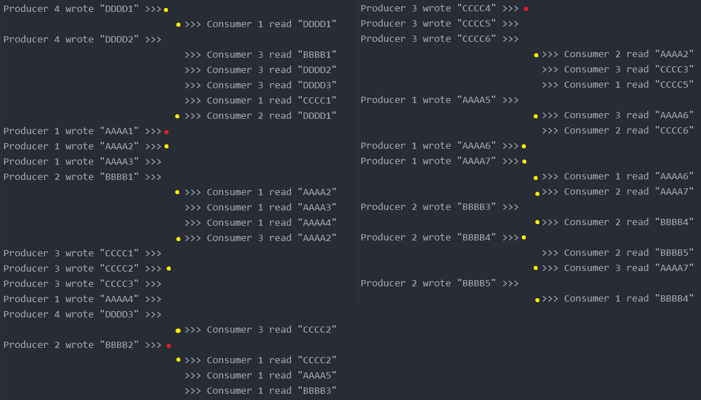

# Практическая работа №3

В ходе данной работы был реализован шаблон producer-consumer с применением различных средств синхронизации:

* Без инструментов синхронизации;
* С помощью мьютекса (sync.Mutex);
* С помощью канала (chan);
* С помощью атомарных инструкций (compare and swap).

### Реализация без инструментов синхронизации

Данная реализация описана в `lab3.NonSync(consumerAmount int, producerMessages [][]string, logging bool)`.

В консоль выводится строка при каждой записи сообщения в буфер и при каждом считывании оттуда сообщения.

Результат работы данной функции с 3 консьюмерами и 4 продюсерами, отправляющими 7, 6, 5 и 3 сообщений:

Сразу же видно, что продюсерами было записано, как и ожидалось,
21 сообщение, а считано было аж 25 сообщений.

Из анализа результата работы программы делаем следующие выводы:

* Отсутствие инструментов синхронизации является причиной проблемы, заключающейся в том, что сразу несколько
  консьюмеров могут считать одно и то же сообщение из буфера, не успев при этом обновить его состояние (на
  изображении жёлтым отмечены сообщения, считанные по несколько раз);
* Ещё одной проблемой является возникновение ситуации, когда сообщение, записанное продюсером в буфер,
  перетирается записью от другого продюсера (такие сообщения помечены красным).

Данные проблемы - наглядный пример т.н. состояния гонки.

### Реализации с применением инструментов синхронизации

#### Синхронизация с помощью мьютекса

Описана в функции `lab3.MutexSync(consumerAmount int, producerMessages [][]string, logging bool)`.

Помимо буфера (переменная типа `string`), заводим переменную, хранящую в себе мьютекс.
Всякий раз при обращении к буферу выполняем функцию `mtx.Lock()`.

Добиться потокобезопасности удалось, но данный способ работает
значительно дольше других из-за характера блокировки.
 
 
#### Синхронизация с помощью канала

Описана в функции `lab3.ChannelSync(consumerAmount int, producerMessages [][]string, logging bool)`.

В данной реализации в качестве буфера используется 1-элементный канал (тип `chan string`).
Продюсеры передают сообщение в канал, а консьюмеры оттуда считывают сообщение.

Данная реализация удовлетворяет требования потокобезопасности, работая при этом значительно быстрее
реализации с использованием мьютекса.
 
 
#### Синхронизация с помощью атомарных инструкций (compare and swap).

Описана в функции `lab3.CasSync(consumerAmount int, producerMessages [][]int, logging bool)`.

В данной реализации в качестве буфера выступает не строка, а число (тип `int32`).

Запись в буфер нового значения происходит с помощью функции `atomic.CompareAndSwapInt32()`.
Сначала мы напрямую извлекаем копию текущего значения буфера, потом, в случае, если буфер оказался
пустым, через операцию CAS заменяем значение в буфере на новое. После вызова функции проверяем, была
ли проведена данная операция успешно. Если да, переходим к следующему сообщению и повторяем процесс.

Чтение из буфера происходит с помощью функции `atomic.SwapInt32()`. С помощью данной функции мы меняем
значение в буфере на 0 (что будет означать, что значение из буфера считано и он очищен) и получаем то
значение, которое находилось в буфере. Если это не 0 (что означает, что буфер не был пустым), сообщаем
об успешном чтении значения из буфера.

Замеры времени показали, что данная реализация работает даже быстрее реализации с использованием
каналов (примерно в 1,5 - 2 раза). Стоит при этом отметить, что результаты двух смежных замеров
могут значительно отличаться друг от друга (например, при среднем времени работы в 210 мс, мы имеем
наименьшее время работы в 113 мс, а наибольшее - 456, что в 3 раза больше минимума).

### Замеры времени

Были проведены замеры всех 3 реализованных алгоритмов при разных входных данных:

1. 10 консьюмеров и 15 продюсеров с 10 000 сообщений с каждого
2. 10 консьюмеров и 5 продюсеров с 30 000 сообщений с каждого
3. 10 консьюмеров и 15 продюсеров с 100 000 сообщений с каждого
4. 10 консьюмеров и 5 продюсеров с 300 000 сообщений с каждого

#### Ситуация 1

В таблице ниже приведены результаты замера времени работы продюсеров и консьюмеров с разными
инструментами синхронизации (значения приведены в миллисекундах).

|         | mtx     | chan   | cas     |
|---------|---------|--------|---------|
| avg     | 181,810 | 42,841 | 34,667  |
| min     | 172,037 | 41,999 | 12,508  |
| max     | 206,525 | 44,016 | 103,506 |
| max/min | 20%     | 5%     | 728%    |

Видно, что пессимистичная блокировка, реализованная с помощью мьютекса, показывает наихудший результат.
Обеспечение потокобезопасности с помощью канала значительно уменьшает затрачиваемое время, при этом
использование CAS также имеет небольшой положительный эффект относительно реализации с каналами.
Примечательно, что минимум и максимум реализации с CAS различаются аж в 7 раз, в то время как другие
реализации выдают примерно одинаковые результаты.

#### Ситуация 2

Значения в таблице приведены в миллисекундах.

|         | mtx     | chan   | cas    |
|---------|---------|--------|--------|
| avg     | 196,847 | 46,588 | 27,724 | 
| min     | 181,067 | 44,998 | 12,000 |
| max     | 222,031 | 47,511 | 89,000 |
| max/min | 23%     | 6%     | 642%   |

#### Ситуация 3

Значения в таблице приведены в миллисекундах.

|         | mtx    | chan    | cas     |
|---------|--------|---------|---------|
| avg     | 1897,2 | 426,120 | 210,514 |
| min     | 1776,2 | 420,507 | 113,506 |
| max     | 2079,3 | 428,555 | 456,468 |
| max/min | 17%    | 2%      | 302%    |

#### Ситуация 4

Значения в таблице приведены в миллисекундах.

|         | mtx    | chan    | cas     |
|---------|--------|---------|---------|
| avg     | 1962,7 | 480,155 | 199,744 |
| min     | 1811,3 | 470,545 | 143,961 |
| max     | 2174,4 | 484,103 | 357,050 |
| max/min | 20%    | 3%      | 148%    |

### Итоги замеров

При увеличении общего количества сообщений время работы реализаций с мьютексом и каналом
увеличивается практически линейно, при это реализация с CAS показала даже большую эффективность
при большем количестве сообщений. В то же время, уменьшение количества продюсеров с сохранением
общего количества сообщений немного увеличивает время работы реализаций с мьютексом и каналом,
в то время как время работы реализации с CAS даже немного уменьшается.

В целом, на основе результатов запусков программы можно отметить, что CAS наилучшим образом справляется
в ситуациях, когда нужно обеспечить потокобезопасный доступ к общему ресурсу, но при этом в языке
Go имеется реализация данных атомарных операций только для примитивных типов и для ссылок. Если же
нужен совместный доступ к более сложным и объёмным структурам, наиболее предпочтительным способом будет
реализация с использованием каналов. Мьютексы, хотя и успешно справляются с обеспечением
потокобезопасности, при этом имеют достаточно простую реализацию, вряд ли подойдут для использования
в критических участках кода, обеспечивающих высокую эффективность работы многопоточной системы.
